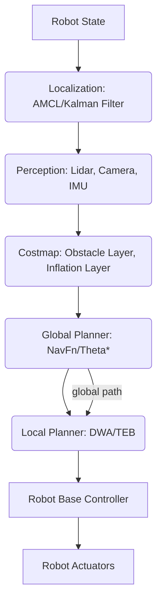

```mermaid
graph TD
    A[Robot State] --> B(Localization: AMCL/Kalman Filter)
    B --> C(Perception: Lidar, Camera, IMU)
    C --> D(Costmap: Obstacle Layer, Inflation Layer)
    D --> E(Global Planner: NavFn/Theta*)
    E --> F(Local Planner: DWA/TEB)
    F --> G[Robot Base Controller]
    G --> H[Robot Actuators]
    E -- global path --> F
```