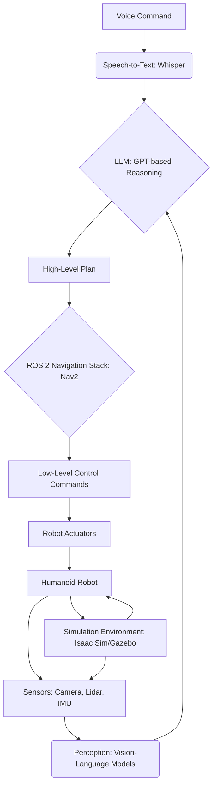

```mermaid
graph TD
    A[Voice Command] --> B(Speech-to-Text: Whisper)
    B --> C{LLM: GPT-based Reasoning}
    C --> D[High-Level Plan]
    D --> E{ROS 2 Navigation Stack: Nav2}
    E --> F[Low-Level Control Commands]
    F --> G[Robot Actuators]
    G --> H[Humanoid Robot]
    H --> I[Sensors: Camera, Lidar, IMU]
    I --> J(Perception: Vision-Language Models)
    J --> C
    H --> K[Simulation Environment: Isaac Sim/Gazebo]
    K --> I
    K --> H
```