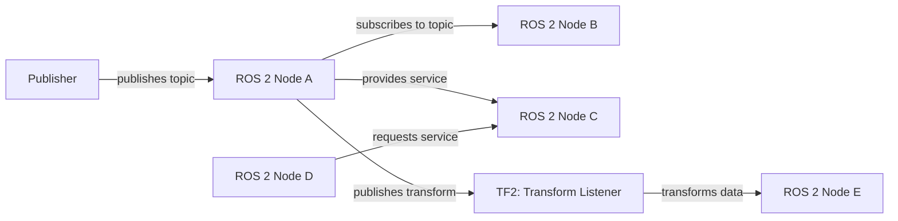

```mermaid
graph LR
    Publisher -- publishes topic --> NodeA[ROS 2 Node A]
    NodeA -- subscribes to topic --> Subscriber[ROS 2 Node B]
    NodeA -- provides service --> ServiceServer[ROS 2 Node C]
    ServiceClient[ROS 2 Node D] -- requests service --> ServiceServer
    NodeA -- publishes transform --> TF[TF2: Transform Listener]
    TF -- transforms data --> NodeE[ROS 2 Node E]
```