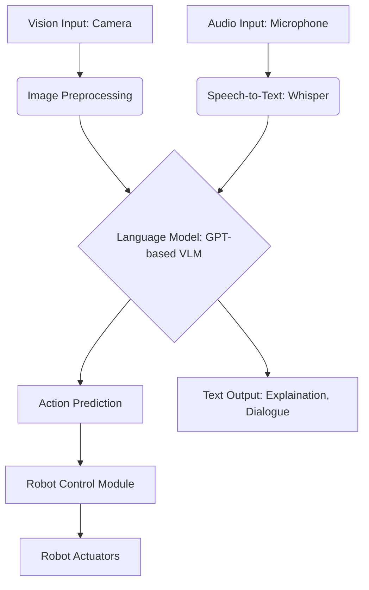

```mermaid
graph TD
    A[Vision Input: Camera] --> B(Image Preprocessing)
    B --> C{Language Model: GPT-based VLM}
    C --> D[Action Prediction]
    D --> E[Robot Control Module]
    E --> F[Robot Actuators]
    G[Audio Input: Microphone] --> H(Speech-to-Text: Whisper)
    H --> C
    C --> I[Text Output: Explaination, Dialogue]
```