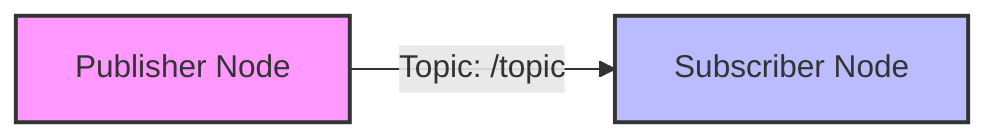

# Chapter 2: ROS 2 Fundamentals and Setup

## Introduction
This chapter introduces the Robot Operating System 2 (ROS 2), a flexible framework for writing robot software. We will cover its core concepts, architecture, and provide step-by-step instructions for setting up a ROS 2 Humble environment on Ubuntu 22.04. Understanding ROS 2 is crucial for building robust and scalable Physical AI applications.

## Core Concepts

### What is ROS 2?
ROS 2 is an open-source middleware suite for robotics development. It provides services that are common to robot applications, such as hardware abstraction, low-level device control, implementation of common functionality, message-passing between processes, and package management. ROS 2 is designed to be real-time capable, multi-platform, and suitable for production environments, addressing limitations of its predecessor, ROS 1.

### ROS 2 Architecture
ROS 2 utilizes a distributed, decentralized architecture based on Data Distribution Service (DDS) for communication. Key architectural components include:
- **Nodes**: Independent executable processes that perform specific tasks (e.g., a camera driver node, a navigation node).
- **Topics**: Named buses over which nodes exchange messages. Messages are data structures containing information (e.g., sensor readings, command velocities).
- **Messages**: The data structures sent over topics. ROS 2 provides standard message types, and users can define custom ones.
- **Services**: Request/reply communication mechanisms for synchronous calls (e.g., a service to trigger a robot's arm to move to a specific pose).
- **Actions**: Long-running goal-based communication, similar to services but with feedback and cancelation capabilities (e.g., sending a goal for a robot to navigate to a target, receiving periodic feedback on progress).
- **Parameters**: Dynamic configuration values for nodes.
- **Launch Files**: XML or Python files used to start and configure multiple ROS 2 nodes and their parameters simultaneously.

## ROS 2 Humble Setup on Ubuntu 22.04

This section outlines the steps to install and configure ROS 2 Humble Hawksbill on Ubuntu 22.04.

### 1. Set Locale
```bash
locale  # check for UTF-8
sudo apt update && sudo apt install locales
sudo locale-gen en_US en_US.UTF-8
sudo update-locale LC_ALL=en_US.UTF-8 LANG=en_US.UTF-8
export LANG=en_US.UTF-8
locale  # verify settings
```

### 2. Add ROS 2 Repository
```bash
sudo apt install software-properties-common
sudo add-apt-repository universe
sudo apt update && sudo apt install curl -y
sudo curl -sSL https://raw.githubusercontent.com/ros/rosdistro/master/ros.key -o /usr/share/keyrings/ros-archive-keyring.gpg
echo "deb [arch=$(dpkg --print-architecture) signed-by=/usr/share/keyrings/ros-archive-keyring.gpg] http://packages.ros.org/ros2/ubuntu $(. /etc/os-release && echo UBUNTU_CODENAME) main" | sudo tee /etc/apt/sources.list.d/ros2.list > /dev/null
```

### 3. Install ROS 2 Packages
```bash
sudo apt update
sudo apt upgrade
sudo apt install ros-humble-desktop python3-colcon-common-extensions
```

### 4. Environment Setup
```bash
source /opt/ros/humble/setup.bash
echo "source /opt/ros/humble/setup.bash" >> ~/.bashrc
# For zsh users:
echo "source /opt/ros/humble/setup.zsh" >> ~/.zshrc
```

### 5. Install Dependencies (Optional, but Recommended)
```bash
sudo apt install -y build-essential cmake git python3-pip libasio-dev libtinyxml2-dev
pip install -U colcon-common-extensions vcstool
```

## Practical Application / Code Examples

Let's create a simple ROS 2 Python package with a publisher and subscriber:

### Create a Workspace and Package
```bash
mkdir -p ~/ros2_ws/src
cd ~/ros2_ws/src
ros2 pkg create --build-type ament_python my_ros2_package --dependencies rclpy std_msgs
```

### Publisher Node (`my_ros2_package/my_ros2_package/publisher_member_function.py`)
```python
import rclpy
from rclpy.node import Node
from std_msgs.msg import String

class MinimalPublisher(Node):

    def __init__(self):
        super().__init__('minimal_publisher')
        self.publisher_ = self.create_publisher(String, 'topic', 10)
        timer_period = 0.5  # seconds
        self.timer = self.create_timer(timer_period, self.timer_callback)
        self.i = 0

    def timer_callback(self):
        msg = String()
        msg.data = f'Hello ROS 2! {self.i}'
        self.publisher_.publish(msg)
        self.get_logger().info(f'Publishing: "{msg.data}"')
        self.i += 1

def main(args=None):
    rclpy.init(args=args)
    minimal_publisher = MinimalPublisher()
    rclpy.spin(minimal_publisher)
    minimal_publisher.destroy_node()
    rclpy.shutdown()

if __name__ == '__main__':
    main()
```

### Subscriber Node (`my_ros2_package/my_ros2_package/subscriber_member_function.py`)
```python
import rclpy
from rclpy.node import Node
from std_msgs.msg import String

class MinimalSubscriber(Node):

    def __init__(self):
        super().__init__('minimal_subscriber')
        self.subscription = self.create_subscription(
            String,
            'topic',
            self.listener_callback,
            10)
        self.subscription  # prevent unused variable warning

    def listener_callback(self, msg):
        self.get_logger().info(f'I heard: "{msg.data}"')

def main(args=None):
    rclpy.init(args=args)
    minimal_subscriber = MinimalSubscriber()
    rclpy.spin(minimal_subscriber)
    minimal_subscriber.destroy_node()
    rclpy.shutdown()

if __name__ == '__main__':
    main()
```

### Update `setup.py` (add entry points)
```python
# my_ros2_package/setup.py

from setuptools import find_packages, setup

package_name = 'my_ros2_package'

setup(
    name=package_name,
    version='0.0.0',
    packages=find_packages(exclude=['test']),
    data_files=[
        ('share/' + package_name, ['package.xml']),
        ('share/' + package_name + '/launch', ['launch/my_package_launch.py']),
    ],
    install_requires=['setuptools'],
    zip_safe=True,
    maintainer='Your Name',
    maintainer_email='your.email@example.com',
    description='A minimal ROS 2 Python package',
    license='Apache-2.0',
    tests_require=['pytest'],
    entry_points={
        'console_scripts': [
            'talker = my_ros2_package.publisher_member_function:main',
            'listener = my_ros2_package.subscriber_member_function:main',
        ],
    },
)
```

### Build and Run
```bash
cd ~/ros2_ws
colcon build
source install/setup.bash
ros2 run my_ros2_package talker
# In a new terminal:
source install/setup.bash
ros2 run my_ros2_package listener
```

## Diagrams and Visualizations

A simple ROS 2 publisher-subscriber communication model:



## Summary
ROS 2 is a robust, distributed framework essential for robotics development. It employs a decentralized architecture with nodes communicating via topics, services, and actions. Setting up a ROS 2 Humble environment on Ubuntu 22.04 involves configuring locales, adding repositories, installing packages, and sourcing setup scripts. Practical examples demonstrate creating Python nodes for publishing and subscribing to messages, forming the backbone of inter-robot and intra-robot communication.

## Exercises / Discussion Questions
1.  Explain the role of DDS in ROS 2 architecture. How does it enhance communication compared to ROS 1?
2.  Describe a scenario where ROS 2 Actions would be more suitable than Services. Provide an example.
3.  Modify the `MinimalPublisher` node to publish custom message types. What steps would be involved in defining and using a new message type?

## References
- ROS 2 Documentation. (n.d.). *Humble Hawksbill (LTS) - Documentation*. Retrieved from https://docs.ros.org/en/humble/
- Open Robotics. (n.d.). *Robot Operating System 2*. Retrieved from https://ros.org/
---
