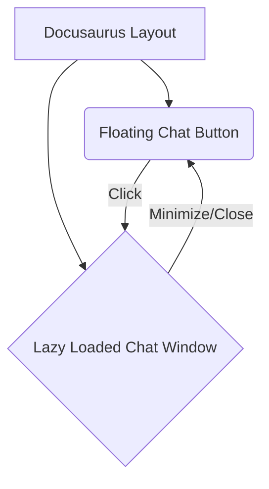

# Research: Chatbot UI Enhancements and Docusaurus Homepage Redesign

## 1. Floating Button Position and Styling

-   **Decision:** The floating button will be positioned at the bottom-right corner of the viewport using `position: fixed; bottom: 20px; right: 20px;`. It will have a clear visual identity (e.g., a chat icon) and sufficient `z-index` to appear above other content.
-   **Rationale:** Bottom-right is a conventional position for chat widgets, minimizing interference with primary content. `position: fixed` ensures it stays in place during scroll.
-   **Alternatives considered:**
    -   **Bottom-left:** Less conventional, might interfere with left-aligned navigation or content.
    -   **Top-left/right:** More intrusive and could interfere with header/navigation.

## 2. Mini Chat Window Design and Animation

-   **Decision:** The mini chat window will appear as an overlay on the right side of the screen when activated, with a smooth slide-in/slide-out animation. It will have clear close/minimize buttons.
-   **Rationale:** An overlay provides a focused chat experience without navigating away from the current page. Animations enhance user experience.
-   **Alternatives considered:**
    -   **Full-screen chat:** Disruptive to the user's browsing flow.
    -   **No animation:** Less polished user experience.

## 3. Homepage Layout Improvements

-   **Decision:** The homepage will be restructured to include a prominent hero section, clear navigation links to key book sections, and dedicated areas for featured content (e.g., latest chapter, popular topics). The layout will leverage Docusaurus's existing grid system or custom CSS for responsiveness.
-   **Rationale:** A well-structured homepage improves discoverability and guides users through the book's content.
-   **Alternatives considered:**
    -   **Minor tweaks to existing layout:** Insufficient to achieve desired UX and readability improvements.

## 4. Color Scheme and Alignment with Book Theme

-   **Decision:** The new UI elements (chatbot button, chat window, homepage sections) will adhere to the existing Docusaurus book theme's color palette and typography.
-   **Rationale:** Maintaining a consistent visual identity ensures a cohesive user experience and prevents the new elements from feeling out of place.
-   **Alternatives considered:**
    -   **Introducing new colors/fonts:** Would clash with the existing theme and degrade visual appeal.

## 5. Component Structure for ChatWidget

-   **Decision:** The `ChatWidget` component will encapsulate both the floating button and the mini chat window logic (state management for open/closed, etc.). It will be integrated into the Docusaurus layout dynamically.
-   **Rationale:** Encapsulation promotes reusability and maintainability. Dynamic integration ensures minimal impact on initial page load.

## 6. Architecture Sketch for Floating Button and Mini Chat Window

