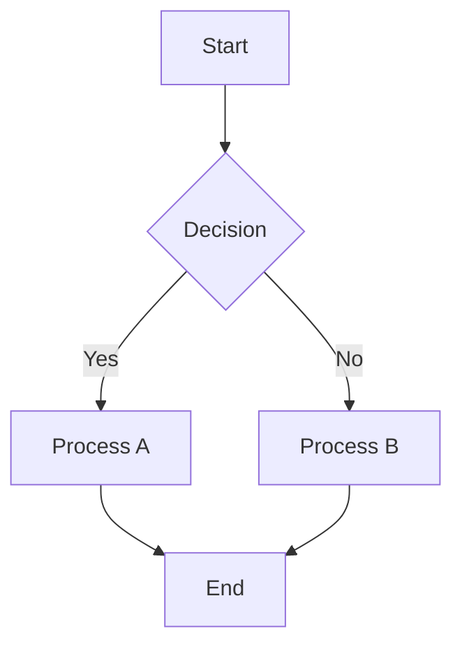

# Chapter Title

## Introduction
Brief overview of the chapter's content and learning objectives.

## Core Concepts
Detailed explanation of key theories, principles, and technologies.
Include definitions, examples, and relevant background information.

### Sub-section 1
Further breakdown of a core concept.

### Sub-section 2
Another detailed sub-section.

## Practical Application / Code Examples
Demonstrations of how the concepts are applied, with code snippets.
Ensure code is well-commented and easy to understand.
```python
# Example Python code
def hello_world():
    print("Hello, Physical AI!")

hello_world()
```

## Diagrams and Visualizations
Embed relevant diagrams (Mermaid, draw.io, etc.) to illustrate complex ideas.


## Summary
Recap of the main points covered in the chapter.

## Exercises / Discussion Questions
Prompts for self-assessment or group discussion to reinforce learning.

## References
List of sources, adhering to APA style.

---
