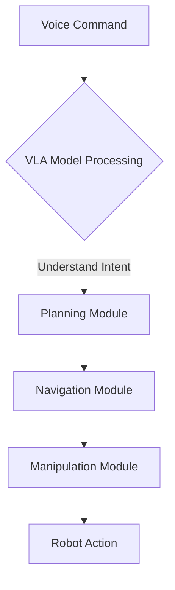
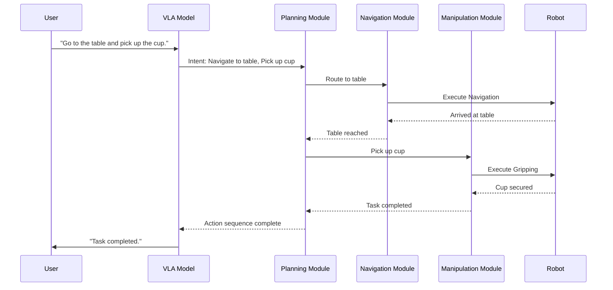

This template provides guidelines for creating diagrams in the Physical AI & Humanoid Robotics book, emphasizing clarity, accuracy, and consistency.

## Diagram Principles

- **Clarity**: Diagrams should be easy to understand at a glance, conveying complex information simply.
- **Accuracy**: All technical details must be correct and align with official documentation (ROS 2, Isaac Sim, etc.).
- **Consistency**: Maintain a consistent style, color scheme, and notation across all diagrams.
- **Readability**: Ensure text labels are clear and legible.
- **Purpose**: Each diagram must serve a specific purpose, illustrating a concept, architecture, data flow, or robot component.

## Tools and Formats

We will primarily leverage Claude Code's diagram generation capabilities. For specific needs, external tools may be used:

### 1. Mermaid Diagrams (Preferred for simplicity and text-based generation)

Use Mermaid for flowcharts, sequence diagrams, state diagrams, and basic architecture diagrams that can be generated directly from markdown.

**Example Mermaid Flowchart:**



**Example Mermaid Sequence Diagram:**



### 2. Draw.io (XML) Diagrams (For more complex or detailed architectures)

For intricate system architectures, robot URDF/TF trees, and detailed sensor pipelines, generate XML output compatible with draw.io (diagrams.net). This allows for full customization and high fidelity.

**Example (Conceptual Draw.io XML Structure - actual content would be much larger):**

```xml
<mxfile host="app.diagrams.net" modified="2025-12-06T12:00:00.000Z" agent="Claude Code">
  <diagram id="V_L_A_Pipeline" name="VLA Pipeline">
    <mxGraphModel dx="855" dy="445" grid="1" gridSize="10" guides="1" tooltips="1" connect="1" arrows="1" fold="1" page="1" pageEnabled="0" pageScale="1" pageWidth="850" pageHeight="1100" math="0" shadow="0">
      <root>
        <mxCell id="0"/>
        <mxCell id="1" parent="0"/>
        <!-- Example Nodes and Edges -->
        <mxCell id="2" value="Voice Input" style="rounded=1;whiteSpace=wrap;html=1;" parent="1" vertex="1">
          <mxGeometry x="80" y="150" width="120" height="60" as="geometry"/>
        </mxCell>
        <mxCell id="3" value="VLA Model" style="shape=cylinder;whiteSpace=wrap;html=1;" parent="1" vertex="1">
          <mxGeometry x="280" y="150" width="120" height="60" as="geometry"/>
        </mxCell>
        <mxCell id="4" value="" style="edgeStyle=orthogonalEdgeStyle;html=1;align=center;verticalAlign=middle;resizable=0;points=[];" parent="1" source="2" target="3" edge="1">
          <mxGeometry relative="1" as="geometry"/>
        </mxCell>
      </root>
    </mxGraphModel>
  </diagram>
</mxfile>
```

### 3. PlantUML (Optional - for specific UML needs)

If advanced UML diagrams (e.g., class diagrams, state machine diagrams with very specific syntax) are required, PlantUML can be used as an alternative.

## Integration into Docusaurus

- For Mermaid diagrams, directly embed the markdown code block as shown above.
- For Draw.io (XML) diagrams, save the XML as a `.drawio.xml` file in `docs/assets/diagrams/` and embed it using Docusaurus's image component or an iframe, ensuring proper styling and sizing.
- Provide a descriptive caption for every diagram.

## Guidelines for Diagram Content

- **Architecture Diagrams**: Clearly show components, their relationships, data flow, and communication protocols.
- **Pipeline Diagrams**: Illustrate the sequence of operations, inputs, and outputs at each stage (e.g., Perception -> Planning -> Control).
- **Robot URDF/TF Trees**: Visually represent the robot's kinematic chain, joints, links, and coordinate frames.
- **Sensor Flows**: Depict how data from various sensors is processed and used by different modules.
- **Code Flow Diagrams**: Explain complex algorithm logic or function call sequences.

---
